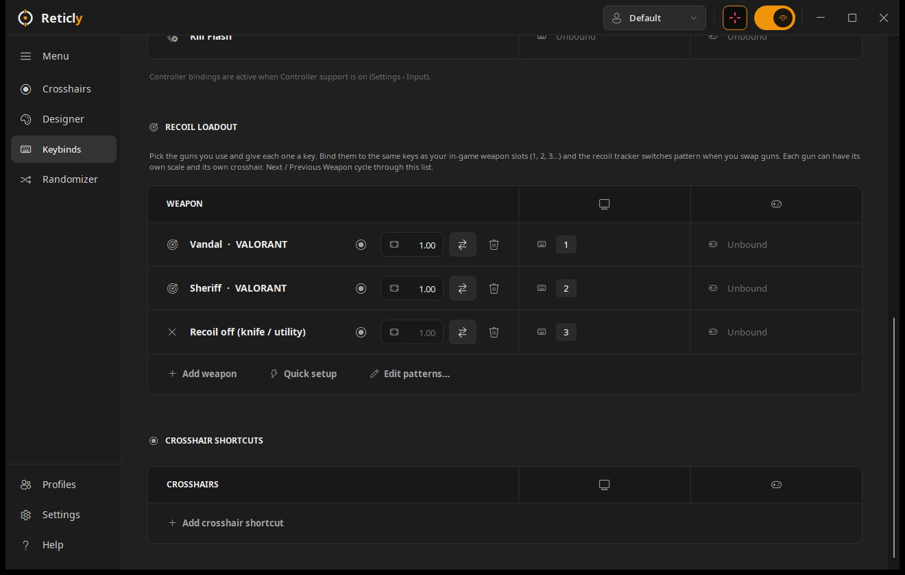

<p align="center">
  
</p>

<p align="center">
  
  
  
</p>

<p align="center"><b><a href="https://reticly.vercel.app">reticly.vercel.app</a></b> · <a href="https://github.com/corund207/Reticly/releases/latest">Download the latest release</a></p>

**Reticly** is a native Windows crosshair overlay. It draws a pixel-perfect crosshair on top of any game, ships a full layered designer with animations, and imports crosshair codes from **Crosshair X**, **VALORANT** and **Counter-Strike 2**. It runs on the .NET Framework that already comes with Windows 10 and 11 — one small `.exe`, nothing to install.

<p align="center">
  
  
</p>

## Features

- **Overlay** — transparent, click-through, always-on-top window that never steals focus. Drawn on the exact center pixel of your monitor in physical pixels; static crosshairs use no CPU, animations redraw at up to 240 FPS.
- **Crosshair X compatible** — renders the Crosshair X design format pixel-for-pixel (lines in every shape, dots, outlines, images, GIFs, shapes, text, drawings and multi-stage animations).
- **Import anything** — Crosshair X share codes and links, VALORANT profile codes, CS2/CS:GO share codes, Reticly codes and raw JSON.
- **Designer** — layers panel, tool dock, zoomable pixel canvas with drag-to-move, collapsible inspector, undo/redo and live on-screen preview.
- **Animations** — fire, aim or autoplay triggers; single press or hold; reset / reverse / pause on release; stages, easing, loop and alternate.
- **Recoil tracking** — crosshairs that follow a weapon's spray while you hold fire, with a weapon picker covering every gun in VALORANT, CS2, Rust and Apex Legends (see below).
- **Spray pattern editor** — drag, add and remove bullets on a grid, test the spray at its real fire rate, add guns or games, or fix a built-in pattern.
- **Hit markers** — hit marker and kill flash reactions (X, ring or brackets) on their own keys or on every shot.
- **Library** — Discover, Browse (100+ built-in designs) and Saved tabs, a community gallery, categories, favorites, search and sorting.
- **Profiles** — per-game crosshair, keybinds, recoil loadout, position and size, switched automatically when a linked game is focused; export a profile to move or share it.
- **Keybinds** — global toggle, aim and fire keys, hide/show/swap while aiming, reload, next/previous crosshair or weapon, hit/kill reactions, position nudging and crosshair shortcuts — keyboard, mouse or controller (XInput).
- **Display** — monitor selection, offsets and saved positions, size and opacity, only-show-in-game, hide from recordings, Fullscreen Assist mode and a Force Borderless tool.
- **Auto-update** — checks GitHub about once a day, verifies the download's SHA-256 and swaps itself in place.
- **Languages** — English, Español, Deutsch, Français and Português (Brasil).
- **Randomizer**, first-run tour, PNG/JSON export, full backup and restore, a tray menu with crosshair, weapon and profile switching, and launch on startup.

<p align="center">
  
  
</p>

## Importing crosshair codes

Press **Import** (or `Ctrl+I`) and paste any of these:

| Code | Example |
| --- | --- |
| Crosshair X share code or link | `xe4lbu6zh8` · `crosshairx.gg/s/xe4lbu6zh8` |
| VALORANT crosshair profile | `0;P;c;5;h;0;0l;4;0o;2;0a;1;0f;0;1b;0` |
| CS2 / CS:GO share code | `CSGO-xxxxx-xxxxx-xxxxx-xxxxx-xxxxx` or `CS…` |
| Reticly code | `CXY1-…` |
| Crosshair JSON | `[{"type":"model", …}]` |

Crosshair X codes are short IDs; Reticly fetches the design from the same public share service that crosshairx.gg share pages use. Reticly shares its own `CXY1-` codes, which contain the whole design and work offline.

## Recoil tracking


Recoil crosshairs are timed animations: while you hold **Fire**, a tracker (the top arm of a plus, a center dot or a chevron) walks along a weapon's spray pattern, then snaps back when you let go. Every recoil crosshair has a **weapon picker** — Game › Category › Weapon — in the Browse preview bar, the Saved card menu and the Designer, and you can bind **Next / Previous Weapon** to switch guns in game (the weapon name flashes under the crosshair).

- **46 recoil crosshairs** in Browse › Recoil Tracking: plus, T, bar, dot, ring, box, bracket, chevron, arrow and text designs, with comet trails, heat ramps (green → red as you spray), swelling and stretching trackers, pull guides that show where to drag, mirrored pairs and animated frames.
- Any layer (lines, shapes, text) can be a tracker; each keeps its own scale, **trail delay**, **direction** (follow / pull guide / mirror) and effects when you switch weapons.
- **91 weapons**: VALORANT (18), Counter-Strike 2 (34), Rust (15) and Apex Legends (24).
- **Accurate first shots** per weapon — the tracker stays centered for the bullets that land dead center before recoil kicks in.
- Fire rate, scale and accurate shots can be tuned per crosshair.
- **Recoil loadout** (Keybinds page) — pick the guns you use and give each one a key, ideally the same keys as your in-game weapon slots. Pressing it switches the active recoil crosshair to that gun's pattern (with its own **scale** and, optionally, its own **crosshair**); a **Recoil off** slot (knife / utility) stops the tracker. **Quick setup** fills in common VALORANT, CS2, Rust and Apex loadouts, and Next / Previous Weapon cycle through your loadout.



> Patterns are approximations, not data extracted from the games. The most popular rifles (★) are hand-tuned; the rest are generated from each gun's fire rate, magazine and recoil traits. Adjust **Scale** for your resolution and field of view. Reticly never reads or modifies game memory.

## Fullscreen

Reticly is a regular overlay window, so it shows over **borderless** and **windowed** games, and over most **DX9 / DX12 "fullscreen"** games thanks to Windows fullscreen optimizations. **Fullscreen Assist** mode re-raises the crosshair the instant a game takes focus. Games running in true exclusive fullscreen can't be drawn over by any overlay window — switch them to borderless, or use **Settings › Display › Force Borderless Fullscreen**.

## Build from source

Requirements: Windows 10/11 and PowerShell. No Visual Studio or .NET SDK needed.

```powershell
git clone https://github.com/corund207/Reticly.git
cd Reticly
.\build.ps1          # add -Run to launch after building
```

The first build downloads the Roslyn C# compiler (`Microsoft.Net.Compilers.Toolset`) from NuGet into `.tools/`. The app is written to `bin\Reticly.exe`.

## Usage notes

- The default toggle key is **Shift + Alt + Z**; change it on the **Keybinds** page.
- Closing the window keeps Reticly in the system tray; right-click the tray icon to exit.
- If a game runs as administrator, run Reticly as administrator too so its keybinds work in that game.
- Your crosshairs, profiles and settings live in `%APPDATA%\Reticly`.

## Project layout

```
src/
  Core/      settings, profiles, library, presets, recoil patterns, JSON
  Render/    crosshair renderer, animation engine, blur, image cache
  Import/    Crosshair X / VALORANT / CS2 / Reticly code importers
  Overlay/   layered overlay window and render thread
  Input/     global keyboard, mouse and controller input
  UI/        main window, pages, dialogs and custom-drawn controls
  Assets/    bundled Noto Sans font
tools/       icon and banner generators
build.ps1    build script
```

## Credits

- Typeface: [Noto Sans](https://github.com/notofonts/latin-greek-cyrillic), licensed under the SIL Open Font License 1.1 (`src/Assets/Fonts/OFL.txt`).
- Icons: Segoe Fluent Icons / Segoe MDL2 Assets, provided by Windows.

Reticly is an independent project. It is not affiliated with, endorsed by or sponsored by CenterPoint Gaming, Riot Games, Valve, Facepunch Studios or Electronic Arts. Crosshair X, VALORANT, Counter-Strike, Rust and Apex Legends are trademarks of their respective owners.

## License

[MIT](LICENSE) © 2026 Jonah
